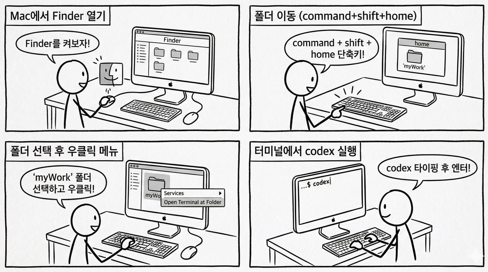
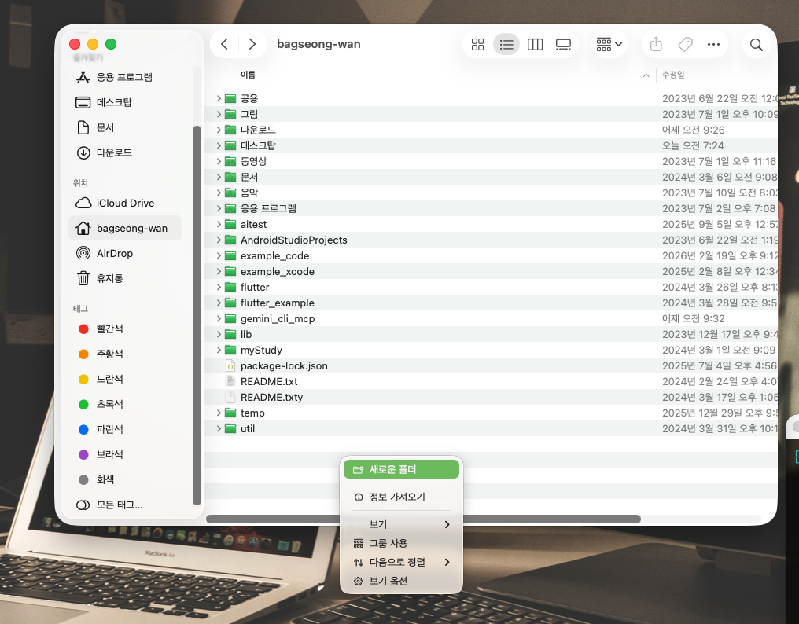
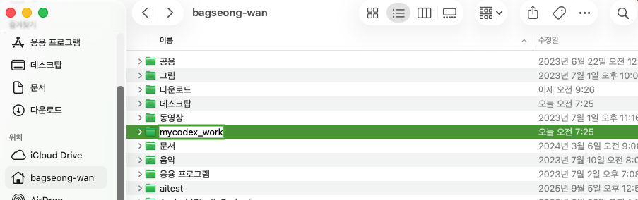
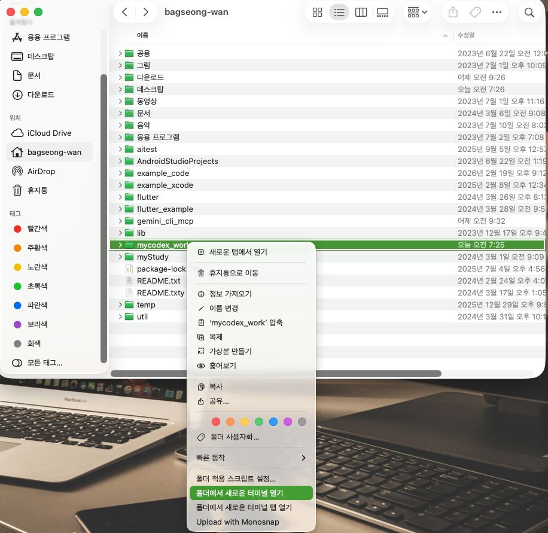
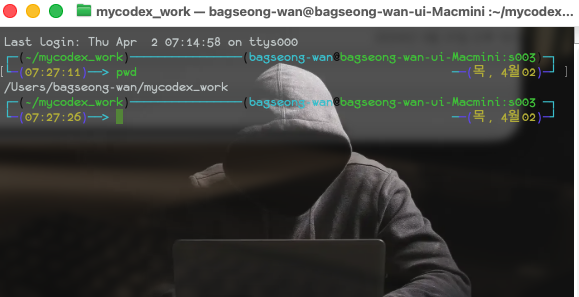
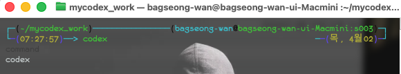
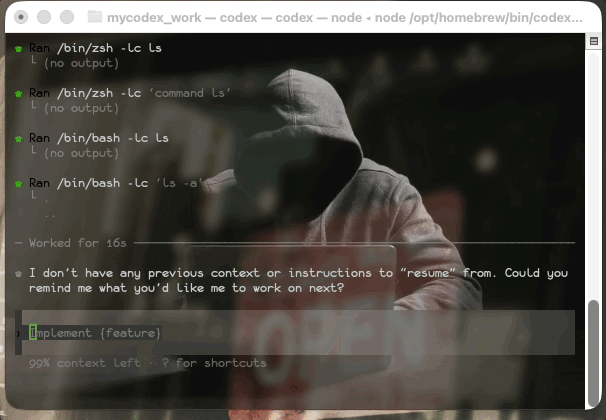
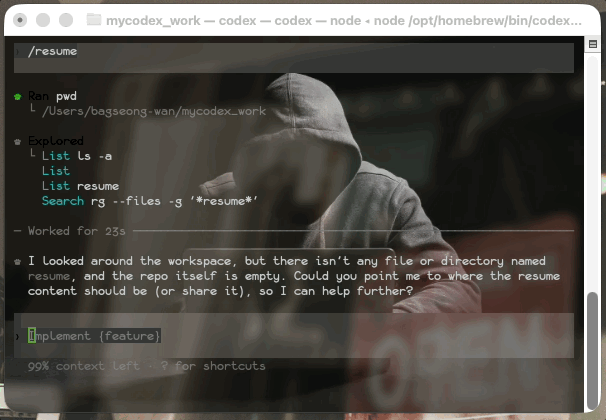
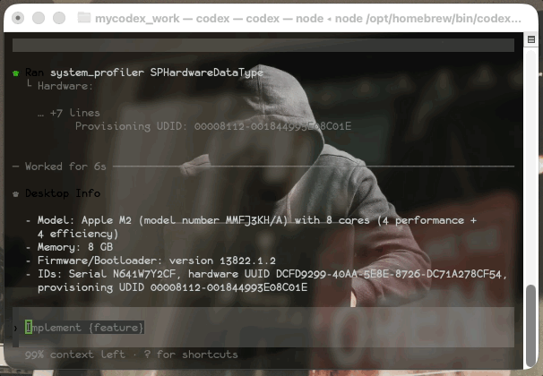
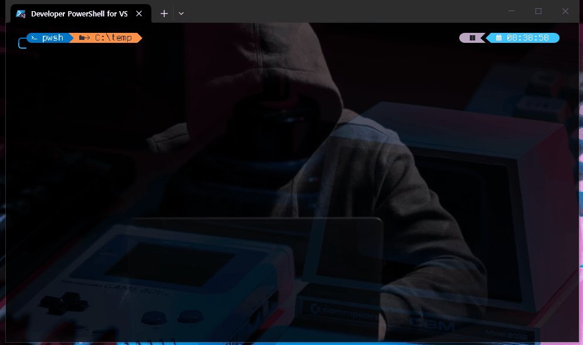

# Mac에서 finder와 codex cli
> 터미널에 익숙하지 않은 비개발자들을 위한 `mac에서 finder와 codex cli를 사용하여 자료 관리`하기를 정리한 메뉴얼

최신 codex app에서는 intel 계열의 cpu에서 실행되지 않는 경우가 발생했다. 그래서 mac의 intel 사용자들은 당분간 codex cli를 사용할 수 밖에 없다. 그런이유로 finder와 터미널을 이용한 codex cli의 기본사용법 숙지는 필수가 되었다.

- nano banana로 전체 흐름 도식화

## 1. finder 실행(홈 이동)

finder를 실행 후, 나의 루트(홈)으로 이동해야 한다. finder가 활성화 된 상태에서 `command + shift +h`를 누르면 나의 홈(보통은 계정명)으로 이동하게 된다.

## 2. 내 작업공간 만들기
> 이미 내 작업공간이 만들어졌다면 새롭게 만들 필요없이 그곳으로 이동하여 codex를 실행하면 된다.

먼저 나만의 공간을 새롭게 만들려면 finder에서 폴더정보가 있는 곳의 빈공간을 클릭 후, 우클릭하면 메뉴가 나온다.그곳에서 `새로운 폴더`를 선택한다.

이곳에서 원하는 폴더명(여기서는 mycodex_work)을 정하고 생성한다.

생성된 폴더를 선택하고 우클릭 한다. 그리고 그곳에 제공하는 메뉴에서 `폴더에서 새로운 터미널 열기`를 선택하면 맥의 터미널이 실행된다.

## 3. codex 실행

터미널 화면은 커스텀 가능하다. 대부분의 개발자들은 자신의 개발환경에 맞게 커스텀하는 것을 필수라고 생각한다. 다음은 커스텀된 터미널 화면이므로 중요한 커맨드 외에는 신경쓰지 않아도 된다. 

`pwd`라는 커맨드를 입력하고 엔터를 누르면 현재 터미널이 실행되고 있는 폴더의 위치가 나온다. 맥은 리눅스 기반이므로 저런 식으로 폴더의 이름을 가지고 있다. 이제 mycodex_work 폴더에서 codex를 실행할 것이다. 그리고 `이 폴더에 파일을 복사`해놓으면 `@`와 같은 문자뒤에 파일명을 기입하여 codex에서 사용할 수 있다. codex에서 참고해야 할 파일들은 `@`를 사용하여 언급함을 잊어서는 안된다.

 

## 6. codex 주요 커맨드

- 종료하기(터미널을 바로 종료해도 된다)

| | |
|-|-|
|`/quit`||

- 커맨드 처리하기(하단 프롬프트 입력영역)

| | |
|-|-|
|` 1     `||
|` 2     `||

- 이전 프롬프트 대화내역 보기 & 선택(화면은 윈도우임.mac도 동일함)

자주 사용하는 커맨드이므로 반드시 숙지가 필요함.

| | |
|-|-|
|`/resume`||

그 외에도 mcp의 정보를 보고 싶다면 `/mcp` 스킬정보가 보고싶다면 `/skills`를 입력하여 엔터를 치면 정보를 볼 수 있다.

