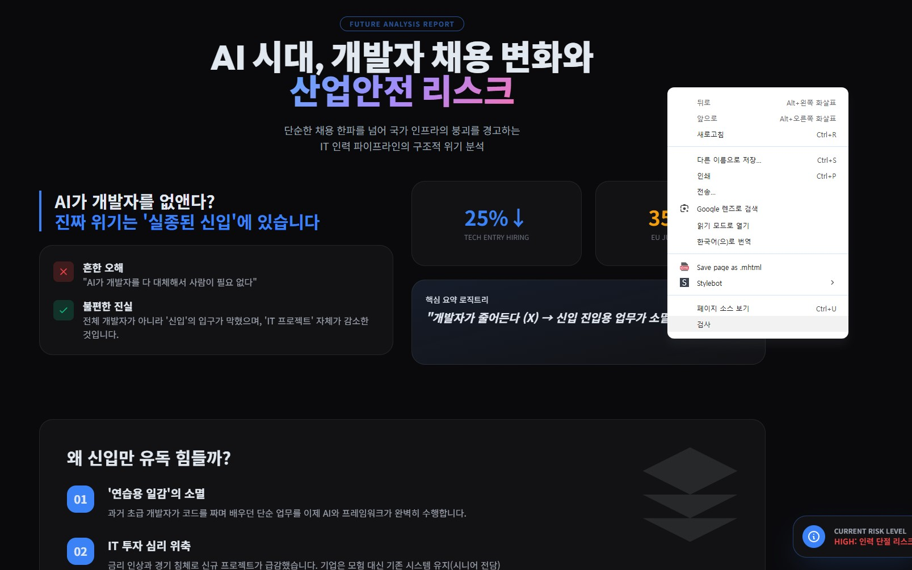
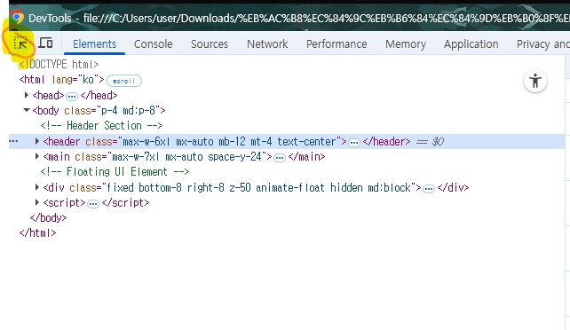
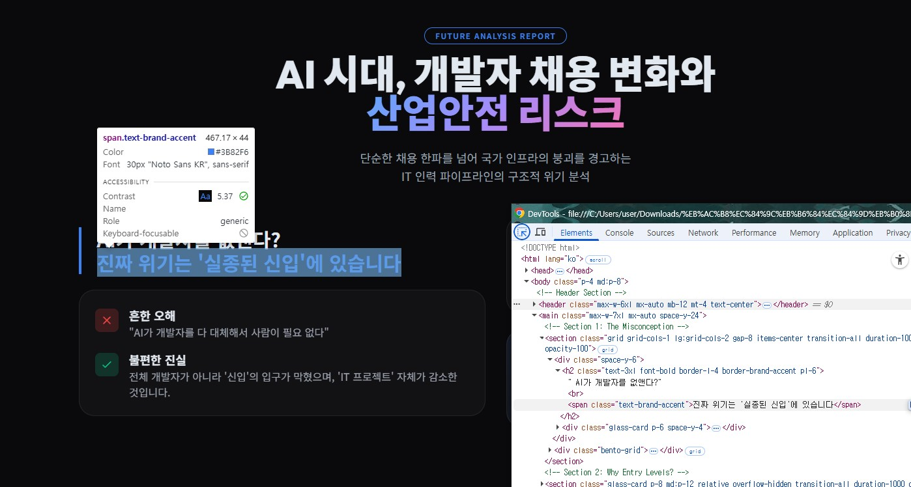
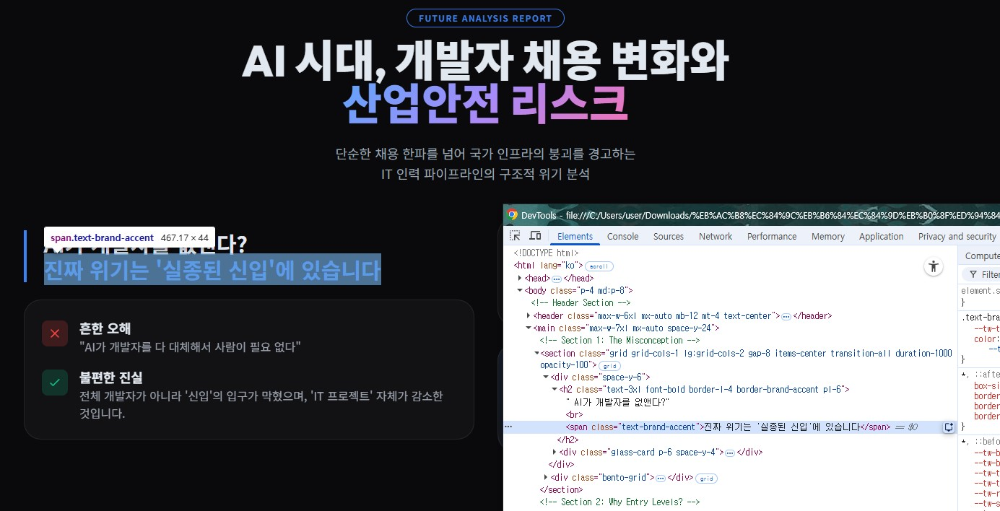
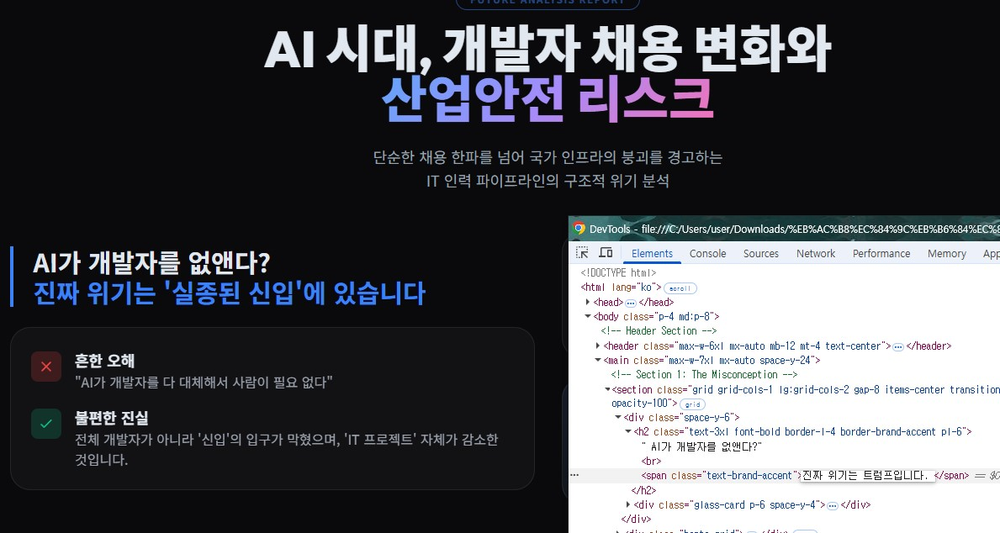
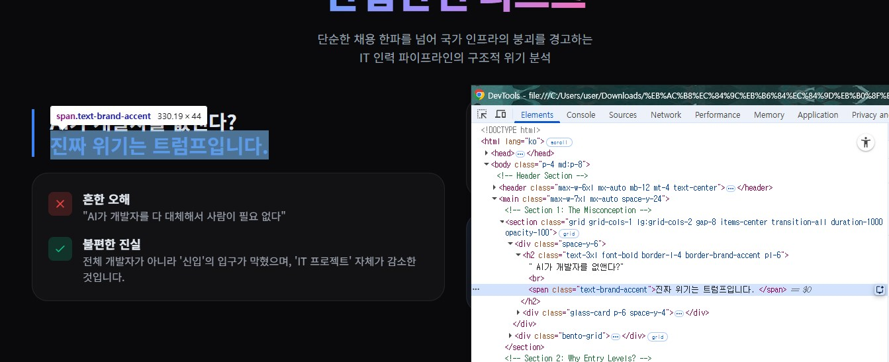
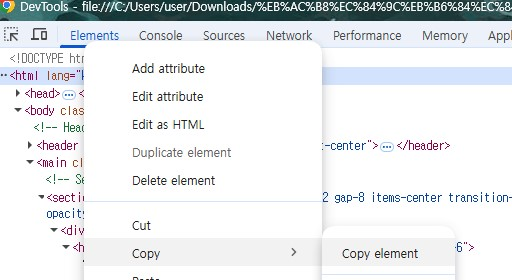
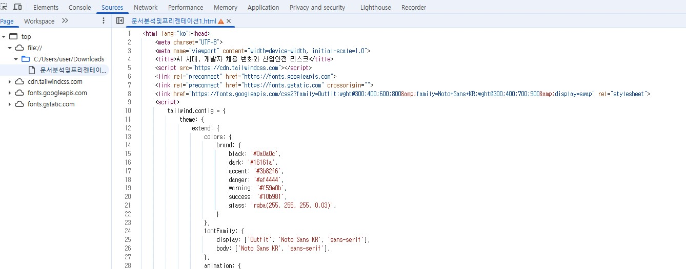
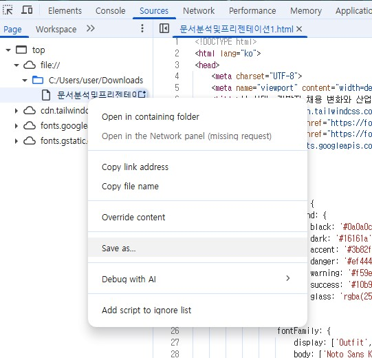

# Chrome 브라우저에서 HTML 고치기
> HTML에 대충만 알아도 화면을 보면서 HTML을 고칠 수 있는 방법

## 1. 설정 및 사용법

- chrome 브라우저 필수
- 다운로드 받은 html을 탐색기 또는 파인더에서 더블클릭으로 읽기
- 크롬브라우저에서 html 읽음(안되면 크롬브라우저 실행화면에 html 파일 drag & drop)
- 크롬개발자도구(웹화면 우클릭 -> 검사 선택)
- 원하는 항목(Element)를 선택 후, 수정
- Sources 탭에서 다른이름으로 html 저장

## 2. 사용예

- 크롬 브라우저에서 HTML 읽은 후, 화면영역 내에서 우클릭 -> [검사] 선택

- 개발자 도구 화면에서 좌측 상단의 항목선택 아이콘 선택. 

- HTML 내의 화면에서 마우스 움직일 때마다 개발자 도구화면에서는 해당 html 항목으로 이동함

- 수정하고자 하는 화면으로 마우스 이동 후, 개발자 도구화면으로 이동하여 선택된 화면을 더블클릭 

- 문자열 수정가능한 Edit 화면으로 변환. 

- 문자를 변경하고 엔터. 웹 화면도 동시에 변함

- 화면을 원하는 대로 모두 변경했다면, 개발자도구 화면에서 최상단의 ..<html을 선택 후, copy ->copy element를 선택

- 상단 탭의 sources로 이동. 지금 읽은 HTML을 선택 후, 복사한 내용을 그대로 붙여넣기

- 좌측메뉴에서 지금 파일을 선택 후, Save as로 다른 HTML로 저장하기

이렇게 하면 HTML을 모른 상황에서도 화면을 보고 문서처럼 HTML을 수정할 수 있음.

